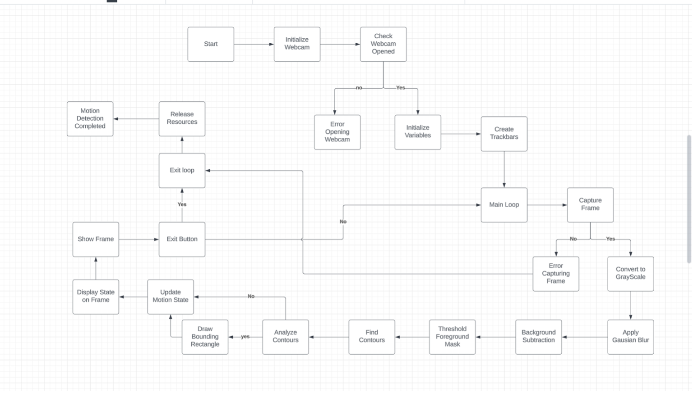

# 🧠 Motion Detector using OpenCV

## 📌 Overview

This project implements a real-time motion detection system using **OpenCV** in Python. It captures video from a webcam, detects movement using background subtraction (MOG2), highlights the largest moving object with bounding boxes, displays the current room state on screen, and records the annotated video.

✨ States:
- `My Room: Object` (motion detected)
- `My Room: Vacant` (no motion for 1 second)

---

## 🚀 Features

✅ Real-time webcam motion detection  
✅ Gaussian Mixture-based background subtraction (MOG2)  
✅ Motion-based room state tracking  
✅ Bounding rectangle around detected object  
✅ Red recording indicator  
✅ Annotated video output as `output.avi`  

---

## ⚙️ Setup Instructions

### 1. Install required packages
```bash
pip install opencv-python
````

### 2. Run the detector

```bash
python motion_detector.py
```

### 3. Stop detection

Press `q` to quit and save the recording.

---

## 🛠️ How It Works

### 1. **Preprocessing**

* Convert frames to grayscale
* Apply Gaussian blur

### 2. **Background Subtraction**

* `cv.createBackgroundSubtractorMOG2()`
* Extract dynamic (moving) regions

### 3. **Motion Detection**

* Threshold + contour detection
* Draw bounding box around largest motion

### 4. **Room State Logic**

* "Object" = motion present
* "Vacant" = no motion for 1s

### 5. **Frame Annotation**

* State text label with OpenCV `putText`
* Red circle in top-right to indicate system running

---

## 🎬 Sample Output

📽️ `output.avi` – recorded annotated video
🖼️ Frame Example: (bounding box + "My Room: Object")

---

## 🧭 Block Diagram

Illustrates the workflow of the motion detection system:



---

## 📋 Assumptions & Constraints

* 🔒 **Static camera** (no movement)
* 🏠 **Indoor** with controlled lighting
* 🔇 **Low video noise** preferred
* 🧍 **Tracks one object** (largest motion)
* ⚙️ **Empirical tuning** of threshold values may be needed

---

## 📌 Code Snippet Example

```python
if current_state == "Object":
    cv.putText(frame, "My Room: Object", (10, 30), cv.FONT_HERSHEY_COMPLEX, 1, (0, 0, 255), 2, cv.LINE_AA)
else:
    cv.putText(frame, "My Room: Vacant", (10, 30), cv.FONT_HERSHEY_COMPLEX, 1, (0, 255, 0), 2, cv.LINE_AA)

cv.circle(frame, (frame_width - 30, 30), 10, (0, 0, 255), -1)
```

---

## 📚 References

* 🔗 [PyImageSearch – Motion Detection](https://pyimagesearch.com/)
* 📘 [OpenCV Python Documentation](https://docs.opencv.org/)
* 🤖 DeepSeek AI – used for UI suggestions (e.g. `putText`, `circle` overlays)

---

## 👤 Author

**Lalith Aditya Chunduri**


```


```
